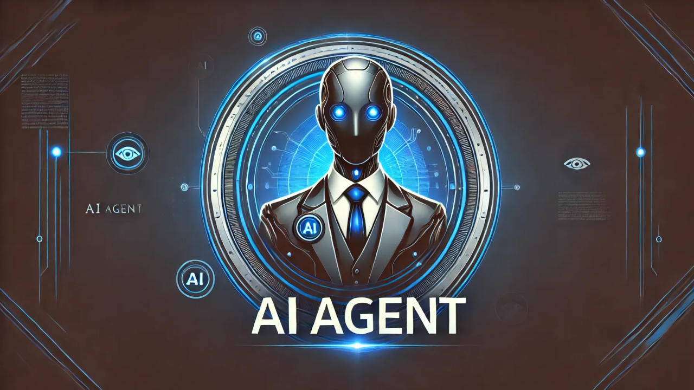

# 🧠 AI Agents App – Intelligent Task Automation with Image Generation & Token Management  
> Built with Next.js 14, TypeScript, Tailwind CSS, and Node.js (Express backend)  
> Self-hosted AI agents with OpenAI integration, rate-limited usage, advanced image generation & persistent output saving
<p align="center">
  
</p>


🚀 A powerful full-stack AI application that enables users to interact with autonomous AI agents performing sophisticated tasks, including multi-agent coordination, image generation, and persistent chat memory—all with secure token-limited access and usage monitoring.

This is **a fully custom-built application**, designed and developed from scratch, combining advanced LLM capabilities with a clean and modern frontend UI.

---

## 📽️ Demo Recording 

A recorded walkthrough :

- Showcase AI agents in action (e.g. research tasks, creative writing, planning)
- Walk through image generation (prompt to result, including sophisticated scenes)
- Show PGAdmin with database structure & query examples
- Point to local backend logs and token checks (free trial logic)
- Demonstrate real-time frontend/backend interaction via localhost

Recording tools: `OBS Studio`, `PGAdmin`, browser console, and `Postman`/DevTools for API behavior.

---

## ✨ Key Features

- 🤖 **AI Agents**: Autonomous agents with distinct goals, persistent memory, and inter-agent communication  
- 🎨 **Image Generation**: Sophisticated image outputs via prompt (OpenAI + custom preprocessing)  
- 💬 **Chat History & Persistence**: Every session saved to PostgreSQL with metadata  
- 🛡️ **Token-Based Access**: Free trial restrictions and usage tracking logic  
- 🧠 **Memory Management**: Output-saving agents and strategic tools in coordination  
- 🔐 **Secure Backend API**: Built in Express.js with request rate limiting  
- 🧰 **Admin Tools**: PGAdmin for viewing sessions, usage, token checks, and more

---

## 🛠️ Stack & Tools

| Layer        | Tech Used                      |
|--------------|--------------------------------|
| Frontend     | Next.js, TypeScript, Tailwind  |
| Backend      | Node.js (Express), OpenAI API  |
| DB           | PostgreSQL (PGAdmin)           |
| Auth/Control | Token-based, session-limited   |
| AI Models    | GPT-3.5-turbo, DALLE-3, + system tools            |
| DevOps       | Docker (in progress)           |

---

## 🚧 Status

- ✅ Core functionality complete  
- ✅ Free trial enforcement working  
- ✅ Token usage and output saving implemented  
- 🔜 Dockerization and deployment  
- 🔜 Video recording + documentation polish

---

## 🧪 Running Locally

```bash
git clone https://github.com/Predaotor/AI-content-Generator
cd ai-agents-app
npm install
npm run dev


